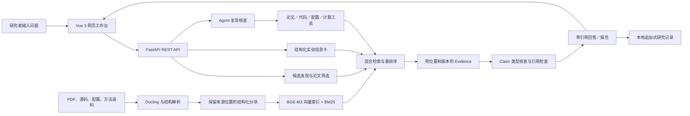

# 复现有据

## 面向计算机视觉研究的论文—代码证据检索与复现核查平台

- **参赛赛道：** 软件赛道（网页应用）
- **作品形态：** Vue 网页 + Python/FastAPI 服务；另含无需后端的本地只读演示
- **文档用途：** 大赛应用方案 Markdown 正文
- **版本日期：** 2026-09-25

> **篇幅说明：** Markdown 本身没有固定分页。正式提交前请导出 PDF，按 A4 页面检查版式并确认总页数不超过 20 页。

## 项目摘要

计算机视觉论文的复现准备需要同时阅读论文、官方代码、配置文件和运行说明。关键信息分散在不同载体中，研究者既要找到答案，也要确认答案对应的论文版本、源码 commit、页码或代码行，以及引用能否支持结论。

**复现有据**是一款面向计算机视觉研究生、科研人员和算法工程师的论文调研与复现准备网页工作台。它将限定语料检索、论文筛选、实验信息卡、版本修订、多论文比较和 Agent 核查连成一条可演示流程，帮助研究者更快形成可复查的复现准备记录。

作品以 RAG 提供证据，以 Agent 组织多步检索和核查，以确定性程序完成引用、结构和前置条件检查，最终生成带来源的回答。当前演示覆盖固定版本的 Swin Transformer、Vision Mamba，以及独立的 QASPER 方法样本。

**竞赛展示亮点：**

- **多源证据贯通：** 同一研究问题可关联论文原文、官方代码和配置来源，并显示版本与定位信息。
- **Agent 过程可见：** 评委可查看任务问题、规划事件、工具选择、执行状态、最终回答和引用。
- **人机协同可追溯：** 字段支持人工修订并保留历史差异；结果不确定时进入复核，而不是覆盖原始记录。
- **演示稳定可复现：** 五阶段网页引导和本地只读案例支持无 API 演示；4 分 50 秒讲解稿已按赛事上限编排。

## 一、项目背景与问题分析

### 1.1 应用背景

计算机视觉研究从阅读论文到启动复现实验之间，包含一系列重复且容易出错的准备工作：研究者要确认方法使用的数据集和输入尺寸，找出训练策略与指标，辨别论文描述和官方代码的差异，沿配置继承关系追踪最终参数，还要核对依赖、代码入口及论文版本。

这些信息分别存在于 PDF 正文、表格、代码、YAML 配置、README 和命令行脚本中。论文可能描述一般方法，代码库可能包含多个模型变体，配置又可能通过 `_BASE_` 继承并被命令行参数覆盖。单纯摘要论文或用通用聊天模型回答问题，无法替代逐项来源核验。

### 1.2 当前痛点

| 痛点 | 具体表现 | 对研究工作的影响 |
|---|---|---|
| 资料分散 | 论文、代码、配置和实验说明需要分别搜索 | 花费时间反复切换来源，容易遗漏实现细节 |
| 版本容易混淆 | 论文修订版、源码分支、模型尺寸或配置变体不一致 | 把一个变体的设置误用于另一个变体，复现结论失真 |
| 引用不等于证据支持 | 问答系统可能给出真实引文，但引文与所述结论关系很弱 | 用户还得重新定位原文并逐句判断 |
| 配置覆盖链难追踪 | 默认值、配置继承、脚本参数和运行时计算分散在多处 | 仅凭论文或单份 YAML 难以还原最终参数 |
| 信息提取重复 | 数据集、训练方法、输入处理、指标等字段需要手工抄录 | 不同论文记录格式不一致，字段缺失也不易察觉 |
| 横向比较口径不一 | 数据集、任务、指标或输入尺寸不同 | 直接比较数值容易形成不公平排名 |
| 结论边界不清 | 对未说明的设计动机或不可运行条件作推测 | 未经证实的说法可能进入实验计划或报告 |

### 1.3 设计原则

1. **先找证据，再写结论。** 搜索结果、字段、回答和报告都保留来源标识。
2. **区分实现事实与研究推断。** 代码中存在某个默认设置，不代表论文说明了该设置的设计动机。
3. **对不同版本和条件保持隔离。** 论文版本、源码 commit、索引配置和评测集均可追溯。
4. **缺失证据时停止或降级。** 显示待复核、证据不足或前置条件阻断，不自动补写事实。
5. **确定性工作交给程序。** 断言条件、数值运算、引用范围和版本差异尽量采用规则核查，语言模型负责需要语义理解的任务。
6. **模型调用可见、可控。** 明确显示任务状态和调用量；在线操作由用户发起，不自动重发可能计费的请求。

## 二、目标用户与典型场景

| 用户群体 | 主要任务 | 关键需求 | 作品提供的帮助 |
|---|---|---|---|
| 计算机视觉方向研究生 | 选题、整理相关论文、准备课程或毕业课题复现 | 快速找到候选论文；知道每个字段来自何处；区分已知与未知 | 论文筛选、实验信息卡、原文引用和历史记录 |
| 科研人员与实验室成员 | 复核既有工作、组织小组调研、比较不同方法 | 统一记录口径；报告结论可以审阅；多成员之间可复查 | 结构化字段、筛选与提取版本、证据比较报告 |
| 算法工程师／模型复现者 | 判断论文代码能否运行、定位参数与输入约束 | 查清代码路径、默认值、配置继承和前置条件 | 论文—代码联合检索、Agent 工具核查、配置和代码证据定位 |
| 指导教师／技术负责人 | 检查学生引用依据与方案可行性 | 快速查看关键结论和反例，避免只看模型生成摘要 | 逐条 Claim 状态、原文位置、不可比条件和审阅记录 |

### 典型任务

研究者提出“论文是否明确解释 Patch Embedding 后默认使用 LayerNorm 的原因”。系统分别检索论文和官方实现：论文证据说明分块和投影过程；代码及配置证据说明归一化默认开启。由于论文材料没有给出作者的明确动机，系统保留“当前证据无法确认动机”的回答，而不把实现事实扩展成作者意图。

## 三、需求分析与产品范围

### 3.1 核心需求

**功能需求：**

1. 使用自然语言查询已构建的论文与代码语料，并显示候选、来源版本和命中证据。
2. 对候选论文作纳入、排除或待定筛选，并保留筛选理由。
3. 提取论文任务、模型、数据集、输入设置、训练策略、指标、结果、局限和代码可用性等信息。
4. 在字段和结论上保留引用、原文位置与核查状态；允许人工补充或修订，并追加新版本。
5. 比较多篇论文的研究字段；条件不一致或缺失时显示不可比，不自动作性能排名。
6. 针对 Swin 固定语料运行 Agent 核查，展示安全处理后的工具轨迹、回答、引用和停止原因。
7. 支持只读离线演示、错误恢复、历史版本查看和 Markdown 报告下载。

**非功能需求：**

- 来源可定位到论文页码、章节段落、源码行或配置路径。
- 文件解析、索引和 Agent 运行可识别版本和配置，便于回归与复现。
- API 密钥不写入代码和报告；公开轨迹不暴露规划器私有文本或原始工具输出。
- 失败和证据不足状态可见；用户的在线生成请求不会因为界面退出而自动重发。
- 首版支持主流桌面浏览器并适配窄屏；离线演示能够在没有 API 的情况下运行。

### 3.2 当前范围与边界

**已实现范围：** Swin Transformer 固定版本深度核查；Vision Mamba 独立论文／源码语料、开发问题及与 Swin 的证据比较；QASPER train 方法样例；混合检索与重排序；筛选与信息卡；追加式历史及任意两版差异；多论文报告；Swin Agent 工具流程；证据面板与离线回放。

**当前不支持：** 全网实时论文发现、用户任意上传并自动建库、任意仓库安全执行、自动调度 GPU 训练、完整实验结果回写、团队帐号及权限管理。在线 API 和稳定公网链接也尚未完成部署。产品在比赛阶段依赖精选语料，不应描述成覆盖全网论文的通用平台。

## 四、总体解决方案

作品将研究流程分为“问题提出—候选检索—论文筛选—信息抽取—证据核查—跨论文比较—报告与复现准备”。AI 负责语义检索、字段建议、问题拆解和工具选择；程序与来源管理负责约束证据范围、验证结构和条件、保存版本并呈现结果。



### 4.1 关键工作流

| 步骤 | 输入 | 系统处理 | 用户得到的结果 |
|---|---|---|---|
| 语料准备 | 固定版本的 PDF、源码快照、配置和说明文件 | 解析、结构化分块、记录 commit／页码／行号并建立索引 | 可追溯的限定语料 |
| 论文发现 | 研究问题或筛选条件 | 元数据约束、语义向量检索、词法检索、融合及重排 | 按来源归组的候选和相关证据 |
| 筛选与抽取 | 单篇论文及问题 | 模型建议筛选状态和字段；程序验证结构与引用范围 | 可修订的信息卡和证据位置 |
| Agent 核查 | 代码、配置或研究问题 | 规划检索、选择工具、提交结构化 Claim、程序核查，再生成回答 | 真实事件轨迹、状态、回答及引用 |
| 比较与报告 | 多篇论文或历史记录 | 对齐字段、展示差异和条件警告 | 带证据位置的比较结果或 Markdown 报告 |

### 4.2 来源与数据管理

解析结果和分块记录论文版本、源码 commit、来源类型及物理位置。Swin 和 Vision Mamba 使用独立 collection；QASPER train 与 validation 的正文及标注分开，避免把答案标签作为可检索正文。索引构建依赖固定配置和输入哈希。研究筛选及提取记录采用追加式 revision，人工修改保留上一版本标识。

源码、配置及其他第三方材料按各自来源、版本和许可管理。当前产品以本机文件、JSON/JSONL 产物和本地 Qdrant 索引为主；原始大文件、模型缓存和部分评测运行材料不随源码一并提交，需要按清单恢复。

## 五、开发工具与技术栈

| 类别 | 当前使用 | 在作品中的作用 |
|---|---|---|
| 开发环境 | Windows、Conda `ican` 环境、Python 3.11、Node.js/npm、Git、PowerShell | 依赖隔离、前后端开发、版本管理和脚本运行 |
| 前端 | Vue 3、TypeScript、Vite、Vitest | 论文工作台、演示中心、信息卡、历史差异、Agent 轨迹与证据面板 |
| 后端 | Python、FastAPI、Pydantic、Pytest | REST API、输入校验、研究服务、Agent 工作流和公开响应投影 |
| 文档解析 | Docling 与项目内来源定位适配 | 解析论文 PDF 与结构化文本，保留页码及来源定位 |
| 向量表示 | `BAAI/bge-m3` 固定 revision，本地推理 | 对论文与代码证据生成 dense 向量；中英文和技术文本语义召回 |
| 检索与索引 | Qdrant 本地持久化、BM25、RRF 融合（[检索说明](p3-retrieval-guide.md)） | 向量和词法检索、标识符匹配、候选融合与按语料隔离 |
| 重排序 | `BAAI/bge-reranker-v2-m3` 固定配置（[检索说明](p3-retrieval-guide.md)） | 对候选证据进一步排序，改善有限上下文中的相关性 |
| 问答框架 | PaperQA2 2026.8.12 的公开接口与 `Docs.aquery`（[接入说明](p2-qa-guide.md)） | 单次带引用科研问答；返回引用、位置、版本和用量 |
| Agent 适配 | 基于 PaperQA2 环境能力的领域环境与项目自建工具／调度 | 限定证据范围、检索论文／代码／配置、核查 Claim 并控制终止条件 |
| 生成服务 | DeepSeek 兼容 API；具体模型按配置与任务显示 | 规划和最终回答。真实 Agent 样例采用 deepseek-v4-pro 规划、deepseek-flash 回答 |
| 安全与展示 | DOMPurify、Markdown-it、Lucide Vue | 清理 HTML、呈现 Markdown 报告、提供图标和交互反馈 |
| 验证工具 | Pytest、Vitest、Vue TypeScript 检查、Vite 生产构建 | 回归 API／核查逻辑、前端映射、类型和构建 |

项目没有针对 Swin 或 Vision Mamba 从头训练新的大模型。Embedding 和重排序使用固定版本的开源预训练模型；生成模型通过服务 API 调用。PaperQA2 是问答与环境的复用基础，领域 Agent 的工具契约、核查规则、前端产品流程和评测方法由项目针对论文—代码—配置问题适配或自建。PaperQA2 原版与本项目领域版的同条件对照仍待完成，不能把二者性能等同。

## 六、AI 在作品中的核心作用

AI 不是独立的聊天窗口，而是被限定在“发现证据、理解研究问题、提出结构化结果、选择有限工具”的流程中。

### 6.1 RAG：让回答建立在指定材料上

1. **解析。** PDF 由 Docling 与项目适配代码处理；源码、Markdown、YAML 等材料保留文件路径、代码行、配置路径或章节信息。
2. **结构化分块。** 按章节、函数、配置块等组织内容，保留原文范围和来源身份，避免将多个模型变体混为同一段。
3. **双路召回。** BGE-M3 处理语义相似问题；BM25 处理 `PatchEmbed`、配置键、指标名等精确标识符。
4. **融合与重排。** 使用 RRF 融合候选，并用固定 reranker 排序；检索范围可以限制 collection、来源类型和安全路径。
5. **受限生成。** 将有限证据交给 PaperQA2 问答适配或 Agent 回答阶段，返回编号引用及来源位置。
6. **证据呈现。** 用户可回到论文页、段落、源码行或配置文件，检查原文是否支持结论。

因此 RAG 的产品价值在于建立“问题—证据—结论”的连接。检索召回本身不等于答案正确，证据也需要人工判断其语义是否足够。

### 6.2 Agent：为复杂核查选择工具和停止条件

普通问答通常一次性生成答案。Agent 工作流将用户请求转成有限的研究动作：规划需要补查的内容，选择限定范围的检索／读取／核查工具，观察返回结果，再决定继续检索、提交结构化结论或结束任务。回答生成在可用证据集和调用预算范围内完成。

领域工具覆盖证据搜索、原块读取、配置及源码约束核查、有限数值计算和 Claim 提交。代码条件由静态断言及输入绑定核查；不会为回答问题而执行未知论文仓库代码。规划器内部文本不会作为产品答案展示；网页只显示经过白名单过滤的工具摘要、真实状态、停止原因、引用和用量。

### 6.3 结论核查与失败降级

Claim 按 `verbatim`、`numeric`、`code_execution`、`inference` 等类型进入相应检查。页面可能显示：

- `supported`：此类型要求的本地检查通过；不代表完整代码已训练成功，也不自动证明自由文本全部语义。
- `blocked_by_precondition`：代码前置条件不满足，不能把后续结果说成可运行结论。
- `insufficient_evidence`：证据范围、引文或条件不足以支持结论。
- `requires_review`：推断或来源状态需要人工复核。

若证据缺失，系统应保留限制，而不是让语言模型补齐未知信息。历史记录可供人工修改和追加新版本；模型失败不会自动触发重复付费调用。

### 6.4 AI 与确定性程序的分工

| 任务 | AI 负责 | 程序负责 |
|---|---|---|
| 候选发现 | 理解自然语言问题，找到相关论文／片段 | 固定语料范围、元数据筛选、来源隔离 |
| 论文信息卡 | 提出字段值、筛选理由和证据引用 | Schema 校验、原文匹配、缺项标记、版本追加 |
| 代码核查 | 识别用户所问条件及引用的相关代码 | 按允许表达式检查数值断言与前置条件，不执行仓库代码 |
| 论文比较 | 用自然语言组织差异说明 | 确定性配对字段、检查任务／数据集／指标，阻止不公平排名 |
| Agent 执行 | 选择限定工具、形成回答 | 工具白名单、预算上限、证据范围、停止状态和安全响应 |

## 七、作品功能逐项说明

| 功能 | 使用者操作 | AI／程序处理 | 结果与限制 |
|---|---|---|---|
| 论文筛选与检索 | 输入研究问题，选择 Swin、Vision Mamba 或 QASPER train 语料，点击“检索论文” | 混合检索、范围过滤和重排 | 显示候选论文、来源版本和证据；只检索已有语料，不进行全网搜索 |
| 论文筛选决定 | 选择一篇候选并查看筛选记录 | 模型可给出纳入／排除／待定建议，证据范围限定于该论文 | 筛选理由可人工修订；模型理由默认需要研究者复核 |
| 实验信息卡 | 点击“从原文生成”或“读取已存卡” | 提取 task、model、dataset、input_setting、training、metric、result、limitation、code_availability | 每条字段附 Claim、引文和位置；`原文匹配`表示字面引用匹配，不保证字段归类在语义上正确 |
| 人工修订与历史 | 点击“修订筛选”或“修订字段”，保存新版本；在记录历史中选两版 | 人工内容经服务端校验并写入追加式 revision；差异在前端确定性计算 | 旧版本保留；同名多条目在没有关联信息时提示人工判断 |
| 多论文比较报告 | 选取至少两篇有信息卡的论文，点击“生成对照报告” | 程序按字段、Claim、证据位置和可比条件构造报告 | 缺少或不一致的任务、数据集、指标及输入条件会产生警告，不自动作性能排名；可下载 Markdown |
| Agent 复现核查 | 在“复现核查”输入问题，选择结论类型，点击“运行核查” | Agent 规划、选工具、检索／核查、提交 Claim，再生成引用回答 | 目前在线 Agent 案例限定 Swin 语料；模型调用可能产生费用，任务时长依服务响应而变 |
| 证据面板 | 点击候选、字段或回答引用 | 按 chunk/source 身份读取已返回的 Evidence | 显示原文摘录、路径、版本、页码／行号；部分原始 PDF 或仓库文件需按清单另行恢复 |
| 演示中心 | 点击“载入 Swin 只读回放”，使用五阶段导航 | 载入打包的演示快照，不向后端提交查询 | 适合无 API 的演示；筛选／卡片和 Agent 轨迹为有来源的预置材料，标为只读 |

## 八、完整用户操作流程与交互指南

### 8.1 离线演示模式

只展示固定 Swin 案例时无需启动模型 API 和后端：

```powershell
cd G:\ICAN\frontend
npm install
npm run dev
```

打开终端显示的 `127.0.0.1` 地址，进入 **演示中心**，点击 **载入 Swin 只读回放**。依次跳转“问题场景—论文筛选—信息卡与历史—Agent 工具—证据与结论”。可点击引用并观察右侧证据面板。演示结束点击 **退出演示**，页面恢复进入回放前的界面状态。

该模式无需 `.env`、API 密钥、模型和向量数据库运行服务；运行时不调用 API、不生成新的研究记录。首次 `npm install` 仍需事先准备前端依赖。

### 8.2 在线研究与复现核查

在线完整工作台需要按 [环境说明](environment-setup.md) 准备 Python 环境、来源文件、索引和模型 API 配置。密钥只能存放在本机环境变量或 `.env` 中，不能写进仓库或录屏。

```powershell
cd G:\ICAN
conda activate ican
python scripts/serve_api.py --host 127.0.0.1 --port 8000
```

另开终端启动 `frontend` 的 Vite 服务。用户可按以下顺序使用：

1. **搜索候选。** 在“论文筛选”输入自然语言问题，选择 collection 并点击“检索论文”。已建索引范围内的检索本身不需要生成模型调用；候选行可查看证据、版本及来源身份。
2. **选论文。** 点击候选标题查看详情，勾选需要处理的论文。可切换 Swin、Vision Mamba 或 QASPER train 示例语料；QASPER train 不等于 QASPER validation 标注。
3. **生成或读取信息卡。** 点击“从原文生成”会请求模型生成筛选与字段建议；调用期间按钮会显示运行状态。点击“读取已存卡”恢复历史，不会重新生成。结果中的待复核和证据不足状态必须按原义阅读。
4. **核对和修订。** 点击字段旁的“查看证据”阅读原文摘录、页码／代码行。使用“修订筛选”或“修订字段”修改内容并保存；保存会建立新 revision，不覆盖先前记录。
5. **比较版本或论文。** 在“记录历史”选择筛选／提取类别和任意两版，查看字段差异、引用和配对提示。跨论文比较至少需要两张信息卡；条件不匹配时报告提示不可比，不强行排名。
6. **下载报告。** 点击“生成对照报告”生成带来源和边界提醒的 Markdown。该步骤依据现有研究记录组织内容，不是新的论文搜索，也不会自动补充缺失实验条件。
7. **运行 Agent。** 在“复现核查”输入问题、选择代码条件／研究推断／数值计算／原文引文类型，再点击“运行核查”。页面等待服务端同步完成；返回后按顺序展示工具轨迹、状态、模型用量、停止原因、答案和引用。
8. **复核结论。** 点击回答或 Claim 的引用，在证据面板核对原文。证据不足、需要复核、前置条件阻断和工具失败都可能是有效终态；它们不会自动变成成功答案。

### 8.3 常见状态与处理方式

| 页面状态 | 含义 | 建议操作 |
|---|---|---|
| 未检测服务 | 尚未发起需要后端的请求 | 若只演示，载入离线回放；若需在线，启动 FastAPI 并执行只读检索检查 |
| 找不到候选 | 当前语料和查询没有匹配项 | 改写关键词、检查选择的 collection，或回到只读案例继续演示 |
| 待人工复核／证据不足 | 原文或字段语义不能自动确认 | 打开证据面板，修订字段或保留不确定状态 |
| 前置条件阻断 | 输入不符合被引用代码里的静态前置条件 | 展示触发的条件，不把后续行为声称为实际运行结果 |
| Agent 无详细轨迹 | 服务只返回状态／答案，未返回事件明细 | 如实展示状态与答案，不补造步骤 |
| 在线失败／预算耗尽 | 任务异常结束或触及预算 | 保存当前页面状态，检查原因后由操作者决定是否用新请求；系统不自动重发 |
| 读取历史失败 | 记录读取请求未成功 | 可重试只读请求；不会因此生成新信息卡 |

## 九、技术验证、评测和现状

### 9.1 当前工程交付

- Swin-T 固定论文／源码解析、结构化分块和可复建索引；来源保留论文版本、仓库 commit、页码、行号与配置路径。
- Swin、Vision Mamba 和 QASPER collection 分离；Vision Mamba 已有 8 道开发问题、来源证据及与 Swin 的逐项比较材料。
- P5 网页工作台、五阶段演示中心、历史差异、只读案例和安全 Agent 轨迹已实现；前后端相关回归、前端类型检查及生产构建已通过。
- P6 冻结评测于 2026-09-24 单次执行：8 道 Swin test、32 道 QASPER validation，每题各执行 Dense QA、Hybrid/Rerank QA 和 Verified Agent，共有 120 个起始任务与终态记录；没有补跑冻结题。

### 9.2 代表性验证结果

项目在冻结问题和独立人工复核样本上验证检索定位、Agent 工具运行和信息卡证据绑定。以下结果用于说明当前工程表现，评测范围和算法口径均可追溯。

| 验证项 | 结果 | 竞赛展示含义 |
|---|---:|---|
| Swin Agent 最终引用必要位置召回 | **81.3%** | 8 道冻结问题中，最终引用覆盖必要论文页／源码行的位置比例 |
| Scoped Dense + QA 必要位置召回 | 50.0% | 固定 Dense 工作流的对照值 |
| Hybrid/Rerank + QA 必要位置召回 | 56.3% | 加入词法融合和重排后的对照值 |
| Swin Agent 非失败终态 | 8/8 | 每题均返回可检查的任务终态；终态可用不等于答案全对 |
| P6 评测完整运行记录 | 120/120 | 8 道 Swin 与 32 道 QASPER validation，三种工作流均保留启动和终态记录 |
| QASPER 字段原文支持（人工逐项复核） | 64/65（98.5%） | 复核样本中，引文能在对应原文定位 |
| QASPER 字段归类（人工逐项复核） | 64/65（98.5%） | 复核样本中，字段类型经人工判断正确 |
| QASPER 缺失字段识别（人工逐项复核） | 16/17（94.1%） | 复核样本中，对原文没有提供的信息作出识别 |

**结果解释：** Agent 的 81.3% 是必要位置召回率，不是答案准确率；Agent 为多步工作流，与 Dense／Hybrid 的调用预算并不相同，因此不将差值宣称为单一组件带来的因果提升。信息卡数据来自 8 篇 QASPER train 论文的小规模定向样本和人工逐项复核，适合说明证据工作流，不外推为全量自动化准确率。一次性 P6 的完整检索、回答、调用、失败状态和其他指标见[冻结评测报告](evaluation/p6-frozen-once-v1/README.md)。

**产品迭代方向：** 自动信息卡仍采用“模型建议—确定性筛查—人工复核”的质量策略。在 8 篇独立样本中，工具提交成功 5/8，尚低于内部目标 7/8；因此产品保留人工查证与追加修订路径，并继续改进工具提交稳定性。详细诊断见[质量报告](evaluation/p46-quality-v2/report.md)及[人工复核记录](evaluation/p46-quality-v2/human-review.md)。

## 十、应用价值、前景与商业模式

### 10.1 预期应用价值

- **个人研究者：** 将原本分散的论文和代码查找组织为可回溯的研究记录，减少重复抄录和来源二次检索。
- **实验室／课题组：** 以共同字段格式积累论文阅读卡和方法比较，便于组内复核和讨论。
- **算法团队：** 在开始训练或迁移模型前，把论文描述、代码默认值和实验参数放在一处核查，提早发现配置或输入条件问题。
- **教学与竞赛：** 展示如何将 RAG、Agent、结构化校验和人类复核组合进一个可信工作流。

以上是根据现有功能推导的预期价值，不是已完成的用户研究结论。项目目前没有经用户实验验证的节时比例、付费意愿、转化率或商业收入数据。

### 10.2 发展前景

先在计算机视觉和模型复现准备这一明确场景中完善来源质量、字段评测和 Agent 的预算／停止策略；之后再由真实研究者反馈决定是否扩充遥感、医学影像等子领域。扩展到新领域前，需要增加领域语料、许可证核对、开发／冻结问题集和人工证据审核，不能只替换提示词即宣称具备专业能力。

后续可探索实验记录与 Git commit 绑定、训练配置差异解释、实验结果回写及实验室知识库协作。这些能力尚未实现，须在验证用户需求和安全边界后再立项。

### 10.3 商业模式假设

| 模式假设 | 目标客户 | 可提供的产品形态 | 需要验证的问题 |
|---|---|---|---|
| 个人研究者订阅 | 研究生、独立研究者、算法工程师 | 限量个人论文库、信息卡历史、按需付费的生成额度 | 用户是否愿为证据引用和版本跟踪付费；可接受的调用成本是多少 |
| 实验室／高校授权 | 课题组、学院、研究平台 | 团队语料空间、共享模板、协作审核与权限管理 | 采购周期、数据归属、团队协作需求和校内部署要求 |
| 企业私有部署与技术服务 | AI 研发部门、模型平台团队 | 私有语料接入、版本管理、API 部署、定制字段和支持服务 | 安全审查、集成成本、更新维护责任及持续付费意愿 |
| 领域语料与工作流服务 | 细分学科研究组织 | 经许可整理的专题语料、证据索引和核查模板 | 版权授权、来源维护成本和对模型效果的验收标准 |

这些是待验证的商业路径，不是当前收入来源。建议先访谈 10–15 位视觉研究者和 3–5 个课题组，观察真实论文复现准备任务，验证：引用是否可用、人工复核时间、最常见的漏项、对本地部署的要求以及付费意愿。通过试点后再评估订阅、团队授权或私有部署的优先级。

## 十一、原创贡献、知识产权与风险控制

### 11.1 项目贡献边界

项目的自建部分包括：论文—源码—配置的统一证据契约；来源位置和版本绑定；结构化 Claim 核查器；配置／代码证据工具及其预算边界；筛选与提取追加式版本流程；不公平比较拦截；安全 Agent 响应投影；演示工作流和项目特定的开发／冻结评测。

项目采用或参考 PaperQA2、Docling、Qdrant、BGE-M3、bge-reranker-v2-m3 等开源组件，使用公开论文及公开研究数据样本。比赛最终提交前仍需对代码、权重、语料、商标／图标和论文图表逐项核对许可证、商用条件、署名和再分发权限，明确哪些为引用、依赖或改造。项目尚未指定自身公开开源许可证；参赛并不自动意味着所有依赖都可任意再发布。

### 11.2 主要风险及应对

| 风险 | 当前处理 | 后续措施 |
|---|---|---|
| 模型生成错误或归类错误 | 保留引用、Claim 状态、人工修订和历史版本 | 扩大新开发样本并由人类复核，达到门槛前保持人工确认 |
| 引用存在但语义不支持结论 | 页面展示原文证据和限定状态；工具按类型核查 | 建立逐条 Claim 评测和独立标注流程 |
| Agent 多步调用延迟和费用 | 显示调用量／用量，限制工具与预算，不自动重试 | 为不同任务设置预算档位并继续测量单位任务成本 |
| 文献、仓库及配置版本漂移 | 来源清单、commit、输入哈希和索引版本固定 | 建立周期性更新与新旧版本迁移审核 |
| 数据／上游许可不清 | 保留来源清单和第三方目录 | 参赛前完成许可证与授权逐项复核及必要署名 |
| 本地运行环境差异 | 提供 Conda、Python、前端命令与离线回放 | 准备干净环境试装和现场备份设备 |
| 评测指标误读 | 冻结报告附口径、失败和不可比条件 | 不以单个 Recall 或词面 F1 代替语义正确性 |

## 十二、实施进度与下一步

| 阶段 | 当前结果 | 后续工作 |
|---|---|---|
| P2：基础 RAG | 解析、分块、Embedding／索引、PaperQA2 问答接口和开发基线完成 | 改进项进入新版本验证，不改变封存基线 |
| P3：混合检索 | Dense、BM25、RRF、重排序和补充证据路径完成 | 持续以新的开发样本检查变体混淆和配置证据覆盖 |
| P4：Agent 与科研流程 | 筛选、提取、比较、结构化核查和 Agent API 已贯通；自动提交门槛仍未通过 | 修复工具提交质量并开展 PaperQA2 原版／领域适配版固定条件对照 |
| P5：网页演示 | 五阶段演示中心、历史差异、只读回放、手机布局和真实轨迹展示已完成 | 依照本方案准备正式比赛演示素材 |
| P6：冻结评测 | 单次冻结评测已完成，报告及运行定义封存 | 保持冻结数据不参与调参；新改进使用新开发样本 |
| 赛事交付 | 本方案 Markdown 和演示操作／讲解稿已形成 | 完成许可证清单、稳定部署、MP4 成片及 PDF 排版检查 |

**近期交付顺序：** 先完成上游版本／许可证／授权核对，准备本地演示备份；再部署并验证稳定访问地址；按 [赛事演示操作手册](contest-demo-operation-manual.md) 录制不超过 5 分钟的 MP4；最后将本方案排版导出并逐页检查不超过 20 页。P6 冻结题和封存结果继续保持隔离。

## 结语

复现有据把论文调研从单次问答扩展为可追溯的研究准备流程：RAG 连接来源与问题，Agent 组织检索和核查，确定性规则检查引用与条件，研究者能够复核字段和版本。当前作品已经具备本地网页、固定视觉语料、历史研究记录、对照报告、Agent 轨迹和原文证据回查能力。下一阶段将围绕工具稳定性、部署与比赛材料继续完善。

## 相关材料

- [需求规格与技术方案](requirements-spec.md)
- [赛事演示操作手册](contest-demo-operation-manual.md)
- [赛事演示讲解稿](contest-demo-script.md)
- [P4.6/P5 科研工作台使用说明](p46-web-guide.md)
- [P5 演示与历史版本使用说明](p5-web-guide.md)
- [P4 科研核查使用说明](p4-research-guide.md)
- [P6 冻结评测报告](evaluation/p6-frozen-once-v1/README.md)
- [P4.6 v2 自动信息卡质量报告](evaluation/p46-quality-v2/report.md)
- [PaperQA2 问答适配说明](p2-qa-guide.md)
- [P3 混合检索使用说明](p3-retrieval-guide.md)
- [开源项目与数据集复用说明](reference-projects-and-datasets.md)
- [语料来源与许可清单](corpus-manifest.md)
- [Vision Mamba 与 Swin-T 证据比较](vision-mamba-swin-comparison.md)
- [开发计划](../task_plan.md)
