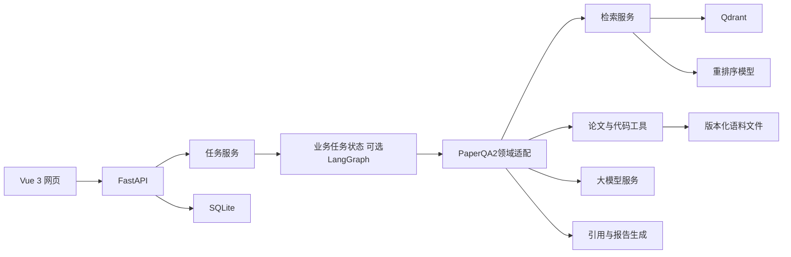

# 《复现有据》需求规格与技术方案

| 项目 | 内容 |
|------|------|
| 文档版本 | v0.1 |
| 日期 | 2026-09-15 |
| 产品形态 | 软件赛道、网页应用 |
| 目标用户 | 计算机视觉方向研究生、科研人员和算法工程师 |
| 核心技术 | RAG、Agent 工具调用、证据引用与评测 |

## 1. 项目背景

计算机视觉研究者在选题和复现实验前，需要反复搜索论文、判断论文是否有代码、提取数据集与训练配置，并在论文、README、配置文件和训练脚本之间核对细节。普通论文问答能够生成摘要，却容易遗漏精确参数、混淆不同实验版本，或者给出无法由引用支持的结论。

本项目把论文调研与复现准备连接为一条工作流。系统先用 RAG 从论文和代码中找到证据，再由 Agent 根据任务决定检索、补查、配置追踪和停止条件，最终输出带出处的研究报告与复现核查清单。

## 2. 产品目标

1. 减少用户筛选和整理计算机视觉论文所需的重复劳动。
2. 让实验设置和比较结论可以回到论文页码或代码位置核验。
3. 在开始耗时训练前暴露依赖、参数、版本和评价口径的不确定性。
4. 通过可观察、可评测的 RAG 与 Agent 实现体现工程能力。

## 3. 产品边界

### 3.1 比赛版包含

- 精选计算机视觉论文库，覆盖分类、分割等方向。
- 自然语言筛选、结构化信息提取、多论文比较。
- 基于混合检索和重排序的带引用问答、研究报告。
- 对 Swin-T 和 Vision Mamba 的论文—代码复现准备核查。
- Agent 执行轨迹、证据详情、结果导出和基础评测面板。

### 3.2 后续版本候选

- 全网实时论文发现与自动增量入库。
- 自动安装、运行和修复任意开源仓库。
- 训练任务调度、GPU 管理和实验结果回写。
- 多人协作、课题组知识库和权限管理。

## 4. 用户角色与核心场景

### 4.1 论文调研者

希望找到满足任务、年份、模型类别和开源条件的论文，并快速比较方法和实验设置。

### 4.2 论文复现者

已经选定论文，希望确认数据、模型、训练、评测、依赖和运行入口是否完整，提前发现待确认事项。

### 4.3 指导教师或团队成员

希望查看一份可追溯的调研或核查报告，复核关键结论使用了哪些来源。

## 5. 功能需求

### FR-01 语料导入与管理

- 系统应支持导入论文 PDF、仓库 ZIP 或已采集的官方仓库快照。
- 系统应记录标题、作者、年份、任务、论文版本、仓库 commit、来源级别和许可证。
- 系统应展示解析和索引状态，失败时指出文件和原因。
- 验收：用户能够查看每个来源的版本、状态和可检索内容数量。

### FR-02 论文筛选

- 用户可用自然语言描述研究问题或筛选条件。
- 系统结合结构化过滤和语义检索返回候选论文。
- 每篇候选显示纳入或排除理由、代码状态和相关证据。
- 验收：明确条件使用元数据过滤，不依赖生成模型猜测。

### FR-03 结构化信息提取

- 提取任务、模型、数据集、输入设置、训练策略、指标、主要结果和代码地址。
- 每个关键字段附论文证据；缺失字段显示“未找到”。
- 用户可纠正结果，纠正记录可进入后续评测集。
- 验收：字段结构固定，证据可定位至页码或章节。

### FR-04 多论文比较

- 用户选择多篇论文和比较维度。
- 系统先分别提取事实，再生成比较结论。
- 不同数据集、任务或指标默认分组展示，并提示不可直接横向排名。
- 验收：每个比较结论至少关联一条有效证据。

### FR-05 带引用问答与研究报告

- 用户可针对论文库提问或指定报告主题。
- 系统展示引用编号，点击后查看原文、页码或代码位置。
- 报告包含检索范围、筛选条件、方法比较、证据和局限。
- 验收：删除来源后，相关结论不得继续显示为已证实。

### FR-06 复现准备核查

- 用户选择论文、仓库版本和目标实验。
- 系统核查数据、预处理、模型与权重、训练配置、依赖、运行入口和评价方式。
- 每项输出“确认一致”“发现差异”“证据不足”，附条件、证据和下一步建议。
- 系统应识别配置继承、命令行覆盖和运行时计算。
- 验收：Swin-T 标准案例能够正确还原人工标注的配置链。

### FR-07 Agent 执行轨迹

- 页面展示阶段、工具名称、参数摘要、结果摘要、耗时和状态。
- 不展示模型私有思维过程；只展示可审计的计划、动作和证据。
- 用户可停止失败或耗时过长的任务。
- 验收：每条最终结论可以追溯到对应工具结果。

### FR-08 报告导出

- 支持导出 Markdown，比赛版争取同时支持 PDF。
- 报告包含语料版本、生成时间、核查结论、引用和限制。
- 验收：导出内容与网页结果一致，引用标识完整。

### FR-09 评测面板

- 展示不同检索方案的 Recall@K、MRR、延迟和成本。
- 展示答案正确率、引用支持率、无答案识别率和 Agent 工具调用指标。
- 验收：结果来源于冻结测试集，并保留运行配置和时间。

## 6. AI 功能的核心作用

### 6.1 RAG 证据层

RAG 不是附加聊天功能，而是所有论文问答、信息提取、比较和核查结论的证据入口。

处理流程：

1. 解析 PDF 章节、表格文字与页码；解析代码、配置和文档结构。
2. 按来源类型进行结构化分块，保存版本和定位元数据。
3. 使用向量检索处理语义问题，使用 BM25 处理标识符和精确参数。
4. 融合候选结果，并用重排序模型挑选有限上下文。
5. 生成结构化答案，为每个声明绑定引用。
6. 校验引用是否支持声明；不足时降级为待确认。

### 6.2 Agent 决策层

Agent 接收用户目标并维护任务状态，负责：

主要复用目标为 PaperQA2 的科研问答与 Agent 能力，通过领域 adapter 增加论文—代码—配置证据及核查工具。接入以固定版本试验为准；LangGraph 如需要则编排外层业务状态，不重复实现内部问答循环。

- 将研究问题拆成筛选、提取、比较或核查子任务。
- 依据当前证据选择论文检索、正文检索、仓库搜索或配置追踪工具。
- 判断证据是否覆盖结论，必要时改写查询并补查。
- 遇到冲突时保留多个证据和适用条件。
- 达到证据条件、资源上限或失败上限时结束任务。

### 6.3 AI 可靠性约束

- 关键字段采用结构化 Schema 输出并做类型校验。
- 每条事实结论必须有关联引用；无引用内容标为分析或建议。
- 默认拒绝根据缺失证据补写参数。
- 限制工具循环、上下文长度、重试次数和单任务预算。
- 保存模型版本、提示版本、检索参数和任务轨迹，支持复现评测。

## 7. 技术方案

### 7.1 系统结构

### 7.2 前端

- Vue 3、TypeScript、Vite。
- 核心组件：筛选器、上传器、论文卡片、比较表、任务时间线、证据抽屉、核查表、报告预览。
- 任务进度优先使用 SSE 推送；无法建立连接时回退轮询。

### 7.3 后端

- FastAPI 提供 REST API、文件处理和任务查询。
- 比赛版使用进程内任务队列或轻量后台任务；稳定性不足时再增加 Redis 队列。
- SQLite 保存业务数据，Qdrant 保存向量与检索元数据，文件目录保存原始语料。

### 7.4 模型与检索

- PaperQA2是问答／Agent框架复用目标，生成模型与Embedding另选；P2.5先验证来源、外部检索和引用adapter，上图表示目标设计而非已接入状态。
- Docling负责文档解析，统一chunk与证据契约保留PDF页、代码行、配置路径与版本；Qdrant通过经验证的检索／证据接口对接。
- 大模型通过统一适配层调用支持结构化输出和工具调用的服务。
- Embedding 优先选择支持中英文和较长技术文本的模型。
- 首版建立 dense 基线，再加入 BM25、RRF 融合和 reranker。
- 模型选择由准确率、延迟、成本和部署条件的实测共同决定。

### 7.5 核心数据对象

- `Paper`：论文元数据和版本。
- `RepositorySnapshot`：仓库地址、commit、来源级别与许可证。
- `Chunk`：文本、来源类型、页码或路径行号、版本和索引字段。
- `ResearchTask`：用户问题、筛选条件、状态与预算。
- `Evidence`：检索得分、重排得分和可定位来源。
- `Claim`：结论、状态、引用集合和置信说明。
- `EvaluationRun`：数据集版本、系统版本、指标和错误案例。

## 8. 非功能需求

- **可追溯：** 关键结论可回到固定版本的来源。
- **可恢复：** 单个文件解析或工具失败不导致整个任务无说明地终止。
- **性能：** 比赛演示的常见问答应在可接受等待时间内返回；实际目标在 M2 基准后确定。
- **安全：** 上传文件限制类型和大小；ZIP 解压防止路径穿越；仓库代码默认只读静态分析，不执行。
- **隐私：** 上传内容仅用于当前项目处理，日志中不记录 API 密钥。
- **兼容：** 比赛演示支持主流桌面浏览器，页面适配 1366×768 以上屏幕。

## 9. 完整使用说明

### 9.1 建立论文库

1. 进入“资料库”，上传论文 PDF，并选择或上传对应官方仓库快照。
2. 补充论文版本、任务、代码来源和仓库 commit。
3. 点击“解析并建立索引”。
4. 查看解析结果；失败文件可单独重试。

### 9.2 筛选和提取论文

1. 在“论文探索”输入研究问题，例如“有官方代码、用于 ImageNet 分类的视觉 Mamba 模型”。
2. 设置年份、任务和是否有代码等条件。
3. 查看候选论文及纳入理由。
4. 打开论文详情，查看结构化实验卡和对应原文引用。

### 9.3 比较论文并生成报告

1. 勾选 2–5 篇论文，选择模型、数据、训练和指标等比较维度。
2. 系统检索每篇论文的必要证据并生成比较表。
3. 点击引用编号复核原文；发现问题时提交纠正。
4. 选择“生成研究报告”，预览后导出 Markdown 或 PDF。

### 9.4 执行复现准备核查

1. 选择论文、官方仓库快照和目标实验，例如 “Swin-T ImageNet-1K 主实验”。
2. 点击“开始核查”。
3. 在时间线中查看 Agent 的计划、检索、文件读取和配置追踪动作。
4. 查看核查表中的一致项、差异项和待确认项。
5. 打开任一结论查看论文页码、代码路径、行号和适用条件。
6. 导出复现准备报告，根据待确认清单继续人工核实。

### 9.5 异常处理

- PDF 无法解析：更换可复制文本版本，或标记需要 OCR。
- 仓库过大：限定子目录、文件类型或目标实验。
- 证据冲突：保留多个来源，显示版本和条件，不自动选择一个为真。
- API 或工具失败：显示失败节点和重试按钮；已完成结果继续保留。
- 证据不足：输出待确认项，不生成确定性参数。

## 10. 验收方案

### 10.1 功能验收

- 用户能够从论文筛选走到报告导出。
- 用户能够从选择 Swin-T 实验走到带证据的复现核查报告。
- 页面可查看 Agent 的真实工具调用和检索证据。

### 10.2 AI 效果验收

- 使用人工标注且冻结的测试集。
- 评测题从真实 GitHub Issue、技术论坛或论文讨论中溯源，社区回复不直接作为标准答案。
- 每题绑定固定论文版本或仓库 commit，并标注支持答案所必需的最小证据集合。
- 12 个开发题与 8 个冻结测试题按问题簇切分，禁止同义题和相同证据集合跨组。
- 对比基础向量 RAG、混合检索 RAG、Agentic RAG。
- 报告 Recall@K、MRR、答案正确率、引用支持率、无答案识别率、耗时和成本。
- 具体阈值在 M2 得到基线后写入 v0.2，避免预设无法验证的数字。

### 10.3 比赛交付验收

- 在线链接稳定可访问，并保留本地运行方案。
- 应用方案 PDF 不超过 20 页。
- MP4 演示视频不超过 5 分钟，展示请求、分析决策、工具调用、结果与实际价值。
- 源代码、安装说明、演示账号或 API 配置说明完整。

## 11. 风险与应对

| 风险 | 影响 | 应对 |
|------|------|------|
| 功能过多导致主流程不完整 | 高 | 精选语料库，深度核查只覆盖两个案例 |
| PDF 公式、表格解析不稳定 | 中 | 首版保留文本与页码，关键表格人工校验 |
| 检索结果相关但不支持结论 | 高 | 引用支持检查与无答案状态 |
| Agent 循环或成本失控 | 高 | 步数、token、超时和重试预算 |
| 外部模型 API 不稳定 | 中 | 适配层、重试、缓存和预制演示结果备份 |
| 截止前部署失败 | 高 | Docker 化、本地演示版本、预留 9/30 缓冲 |

## 12. 需求变更记录

| 版本 | 日期 | 变更 | 提出原因 | 影响范围 |
|------|------|------|----------|----------|
| v0.1 | 2026-09-15 | 创建首版需求、技术方案和使用说明 | 将已确认方向形成工程基线 | 全项目 |
| v0.2 | 2026-09-15 | 增加真实社区问题溯源、证据闭包与 12/8 冻结评测规则 | 建立可信且防泄漏的 Swin-T 评测集 | FR-09、AI 效果验收 |
| v0.3 | 2026-09-16 | PDF 解析复用 Docling 结构化 JSON；跨页失效定位从原 PDF 恢复并记录；QASPER 独立外部基准 | 根据开源复用调研与本机比较调整技术实现，保留来源契约 | 文档解析、证据定位与评测；产品范围沿用原版 |
| v0.4 | 2026-09-16 | PaperQA2提升为主要问答／Agent复用目标；以领域adapter扩展代码／配置核查，接入先实测；LangGraph如保留只负责外层业务状态 | 用户要求基于成熟科研RAG框架针对本项目改造；下一节点保持结构化分块 | AI技术方案、P2.5/P4；生成模型与Embedding仍独立选型 |
| v0.5 | 2026-09-16 | P2.2已交付配置驱动结构分块；原文／embedding上下文分离，来源、连续字符范围、物理页／行、表格核验状态与QASPER段落位置保留 | 固定后续索引与PaperQA2 adapter的证据输入契约 | 建库与引用技术实现；cl100k仅预算计数，P2.3重新核验真实Embedding tokenizer；产品功能范围沿用 |

## 13. 待决策事项

**P2.6实施更新（2026-09-17，v0.9）：** 增加隔离gold的评测管线、密封检索快照、预算累计／恢复journal及官方QASPER多标注评分；定位代理、完整行／段落覆盖、答案词面F1与引用语义支持分开报告。47题dense检索已完成，预算回复前生成0；生产问答和产品范围不变。默认配置对照单独记录sources数量、serializer及评测语言差异，完整上游Agent留后续。详见[p2-baseline-report.md](p2-baseline-report.md)。

**P2.5实现更新（2026-09-17，v0.8）：** 已批准的领域adapter方案实际复用固定PaperQA2 2026.8.12公开对象和aquery；只读问答API消费既有检索证据，返回编号引用、完整位置／版本、用量及可靠性状态。原始LLM输出先保存，避免上游示例ID删除绕过校验。用户选择DeepSeek deepseek-flash，OpenAI SDK单次生成，无重试／fallback／summary／远程embedding；8块／18000原文字符、1536输出tokens、90秒生成超时。真实功能样例通过，网页／Agent和正式语义评测继续原后续节点。详见[p2-qa-guide.md](p2-qa-guide.md)。

**P2.3实现更新（2026-09-17，v0.6）：** 首版Embedding固定本地BAAI/bge-m3 revision `5617a9f61b028005a4858fdac845db406aefb181`，Sentence Transformers dense-only／CLS／1024维Cosine；实际tokenizer限长检查、模型与输入字节身份、来源payload和immutable索引版本已验收。Swin／QASPER train／validation分collection。本地Qdrant仅单进程访问；P2.4来源类型／路径约束用于处理近似变体，P3再评估混合检索，PaperQA2接入仍在P2.5。

**P2.4实现更新（2026-09-17，v0.7）：** 提供只读FastAPI证据接口，使用固定BGE-M3查询编码，支持collection、来源类型和安全路径前缀约束，返回原始chunk、版本、位置、核验状态及分数。真实HTTP查询证实路径约束可排除SwinV2／SwinMoE目录；此为接口功能验证，不是回答正确率。端点不生成文本、不执行Agent，P2.5开始Agent规划或回答生成前切换最高阶模型。

- 批量生成评测预算和reranker选型；首版生成已配置DeepSeek deepseek-flash，Embedding固定BGE-M3，替换须形成独立版本与评测。
- 是否在比赛版加入在线论文搜索，或仅展示精选库筛选。
- PDF 导出采用前端打印方案还是后端排版生成。
- 部署平台、域名和演示账号方案。
