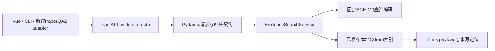

# P2.4 检索证据接口设计

## 范围

本节点将P2.3的本地Qdrant持久化索引封装成FastAPI只读检索服务。它接受自然语言查询与明确的来源过滤，返回可定位的证据；不调用生成模型，不规划Agent步骤，也不产生答案、总结或报告。

## 方案选择

备选方案如下：

1. 仅提供命令行检索：开发快，但Vue和后续PaperQA2 adapter仍需重写接口。
2. FastAPI证据接口：形成稳定HTTP契约，可供页面、评测和后续adapter共同复用。
3. 直接加入聊天问答：看似可演示，但会混合检索和生成，无法定位P2.3已发现的变体召回问题。

采用方案2。该决策已经由用户确认。

## API 契约

`POST /v1/evidence/search` 请求：

```json
{
  "query": "Swin-T 标准配置的窗口大小",
  "collection": "swin_v1",
  "limit": 5,
  "filters": {
    "source_types": ["config"],
    "path_prefixes": ["configs/swin/"]
  }
}
```

- `query` 去除首尾空白后必须非空，最大长度4096字符。
- `collection` 只能是已发布索引的三个collection之一。
- `limit` 范围1–20，默认5。
- `source_types` 可选，值限定为`paper`、`code`、`config`、`documentation`。
- `path_prefixes` 可选，最多20项；每项是相对于固定source根的正向前缀，拒绝绝对路径、空项、反斜杠和`..`。

成功响应：

```json
{
  "index_fingerprint": "<完整指纹>",
  "collection": "swin_v1",
  "query": "Swin-T 标准配置的窗口大小",
  "filters": {"source_types": ["config"], "path_prefixes": ["configs/swin/"]},
  "results": [
    {
      "rank": 1,
      "score": 0.0,
      "chunk_id": "<稳定chunk id>",
      "text": "<原始chunk正文>",
      "source": {
        "source_id": "<来源id>",
        "source_type": "config",
        "source_path": "configs/swin/swin_tiny_patch4_window7_224.yaml",
        "source_version": "<固定版本>",
        "location": {"start_line": 1, "end_line": 20}
      }
    }
  ]
}
```

返回只包含已入库payload中的文本和定位字段，不能拼接、解释、改写或推断内容。无结果返回200与空`results`；无效请求返回422；索引缺失、损坏或模型不能加载返回503，且不暴露文件系统绝对路径。

## 架构与边界



`EvidenceSearchService`负责加载已验证的索引manifest与查询encoder，构造Qdrant过滤条件，映射最小证据DTO。路由只处理HTTP与错误映射。应用创建时使用单一service实例；P2.3的local Qdrant限制要求单worker，测试可通过依赖覆盖使用fake service，不触及真实2.29GB模型。

路径约束使用payload `chunk.source_path` 的正向匹配；它解决“把Swin-T限定到configs/swin目录”的场景，不能取代P3的BM25、RRF和rerank评测。查询日志只记录请求ID、时间、索引版本、collection、过滤条件、结果数和耗时，不记录生成内容、模型私有推理或用户密钥。

## 验收与非目标

- Pydantic拒绝越界limit、未知collection、非法source type、空查询和路径穿越。
- fake Qdrant／encoder测试验证filter映射、结果排序、最小来源定位和日志脱敏。
- 集成测试用已发布索引证明：中文窗口大小查询仅加`config`过滤会出现不同变体；再加`configs/swin/`前缀时结果均在标准Swin配置目录。该检查不读取冻结gold答案，也不报告正确率。
- FastAPI TestClient覆盖200、422、503和空结果。
- 无Agent循环、无LLM调用、无回答生成、无重排、无BM25、无用户上传与无多worker部署。

## 下一节点边界

P2.5才能评估PaperQA2 adapter和带引用问答。进入Agent规划或回答生成前，须先提醒用户切换最高阶模型。
