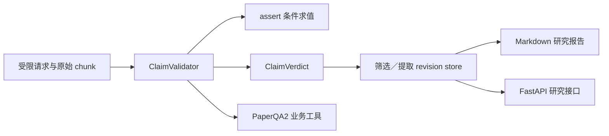

# P4.3 科研业务核查设计

## 目标

在既有 P4.1／P4.2 的受限证据与 Agent 工具上，交付可审计的结论核查、论文筛选记录、结构化信息提取卡和多论文 Markdown 研究报告。该阶段优先修复“引用存在但代码结论错误”的问题，不把模型的自然语言判断当作事实验证。

## 选择的方案

采用“结构化结论 + 确定性核查”。模型或用户只能提交候选结论及其原始证据 ID；本地核查器决定每项状态。相比自由文本报告，这会增加字段约束，但能让用户看到推断、条件失败和证据不足。相比只用人工表单，保留 Agent 可调用的业务工具和带引用产物。

## 范围与非目标

- 交付 `verbatim`、`numeric`、`code_execution`、`inference` 四类结论的 schema、验证与状态。
- `code_execution` 从已验证的原始 Python 源文件提取被引用行范围内的简单 `assert`，用调用方显式 bindings 静态求值；断言失败会阻断“可执行”结论。
- 交付带 revision 的筛选／提取记录和引用报告。记录仅落入 Git 忽略的 `data/processed/research/p4-v1/`。
- 交付无需模型的 FastAPI 提交、核查和报告接口，并将相同操作注册为 PaperQA2 环境工具；离线测试使用 fake runtime。
- 不承诺自然语言语义蕴含自动判定：`inference` 始终为 `requires_review`；`verbatim` 只验证 quote 确实出现；`numeric` 只验证有界计算结果。
- 不启动 P4.4 外部基准或批量真实模型调用。P4.3 的 Agent 工具可用性以 fake runtime 和真实原始 Swin 代码验证；新的付费验收预算在 P4.4 单独建立。

## 核心数据与状态

`ClaimDraft` 包含 statement、kind、至少一个 evidence ID，以及 kind 特有的 quote、calculation 或 conditions。`ClaimVerdict` 返回不可伪造的原始证据、状态和诊断。

| kind | 必要核查 | 可得到的状态 |
|---|---|---|
| `verbatim` | quote 在每个指定原始 chunk 中精确出现 | `supported`／`insufficient_evidence`／`requires_review` |
| `numeric` | 有界算术成功且计算引用在请求范围内 | `supported`／`insufficient_evidence`／`requires_review` |
| `code_execution` | 至少一个被引用范围内的 Python `assert` 被解析，所有条件用 bindings 通过 | `supported`／`blocked_by_precondition`／`insufficient_evidence`／`requires_review` |
| `inference` | 仅校验证据 ID、范围与原文身份 | `requires_review`／`insufficient_evidence` |

`review_required` 原始 chunk 不会被升级为 `supported`。状态不是置信度，也不是模型判断正确率。

`ScreeningRecord` 以论文来源 ID、纳入／排除／待定决定和 Claim 列表组成；`ExtractionRecord` 固定收集 task、model、dataset、input_setting、training、metric、result、limitation、code_availability 九类字段；每个字段带自己的 Claim。保存操作创建新 revision，不覆盖旧记录。`ResearchReport` 仅渲染已保存 revision，并按 paper、字段、状态和来源输出；非 `supported` 字段在报告中保留状态和原因。

## 模块边界

- `ican/research/schema.py`：严格 Pydantic 输入／输出契约、字段与边界。
- `ican/research/claims.py`：不执行仓库代码的 AST assert 求值和 Claim 状态机。
- `ican/research/store.py`：锁定的追加 revision 文件存储与读取；文件名为 UUID，不使用用户路径。
- `ican/research/service.py`：利用 `AgentCorpus` 的同一来源／家族／路径范围做验证，提交筛选与提取，生成 Markdown。
- `ican/agent/environment.py`：注册 `verify_claims`、`record_screening`、`record_extraction`、`build_research_report`；只处理已进入证据池的 ID。
- `ican/api/app.py`：惰性创建研究服务，增加无模型的 research endpoints。health 不加载索引、模型或研究存储。

## 安全与错误处理

代码条件仅允许数值常量、bindings 名称、加减乘除、整除、取模、幂、比较和布尔 `and/or/not`；禁止调用、属性、索引、赋值和未知名称。解析失败或条件范围外只产生 `insufficient_evidence`，不执行 Python 或仓库代码。

所有 evidence ID 都经当前 `AgentCorpus` 的 collection、模型家族、来源类型和安全路径限制验证。报告只能引用保存 revision 中已核验的来源。非法 revision ID、重复字段、超过输入上限或未知字段返回 422；存储写入使用 file lock 且保留旧 revision。

## 验收

1. 112 场景以 `H=7,W=7` 对 `PatchMerging.forward` 的偶数断言得到 `blocked_by_precondition`，不会再报告可进入 3×3 stage。
2. quote 不存在、范围外 evidence、未知绑定、动态 assert、review_required 及错误计算各自得到明确状态。
3. 人工或 fake Agent 写入筛选和提取记录，第二 revision 不覆盖第一 revision；报告同时显示支持项与不足项及原始位置。
4. API 返回严格 response model，health 仍为 model-free；所有离线测试、Ruff 和保护输入哈希通过。

